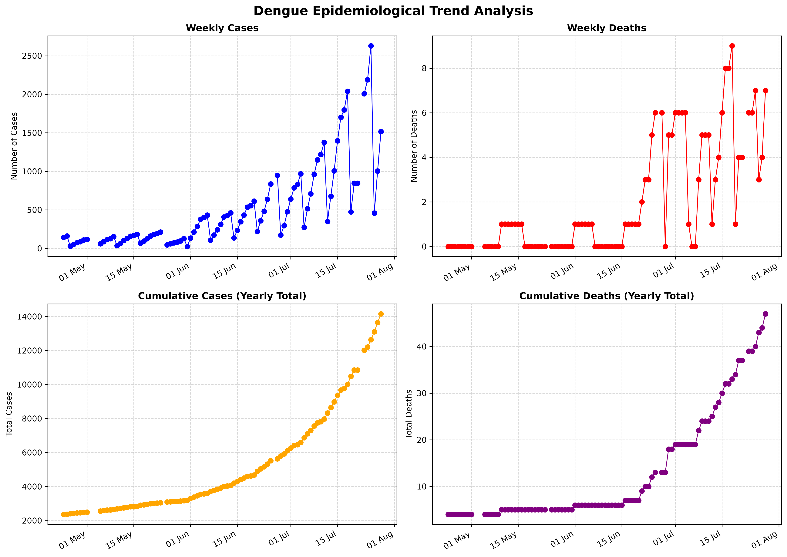
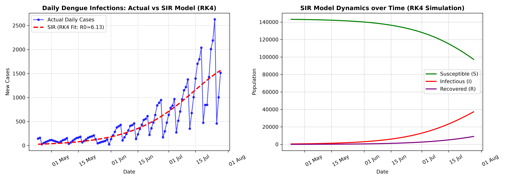

# Dengue Outbreak Modeling in Bangladesh using SIR & RK4 Solver

An end-to-end Data Science and Mathematical Modeling project analyzing Dengue epidemic trends in Bangladesh. This project extracts data from official DGHS reports, cleans time-series case figures, and fits a **Susceptible-Infectious-Recovered (SIR)** model solved via a **4th-Order Runge-Kutta (RK4)** numerical integrator.

---

## 🌟 Key Features & Workflow

1. **Automated Data Acquisition (`pdf_downloader.py`):** Script to scrape and download daily Dengue Press Release PDFs from DGHS.
2. **Data Pipeline:** Extracted and digitized Bengali PDF records into a structured CSV/excel dataset with missing-value interpolation.
3. **Exploratory Data Analysis (`report_visualizer.py`):** Plotted daily infections, mortality trends, and cumulative case distributions using Matplotlib.
4. **Epidemiological Modeling (`main.py`):**
   - Formulated system of non-linear Ordinary Differential Equations (ODEs) for SIR dynamics.
   - Solved ODEs using a custom **4th-Order Runge-Kutta (RK4)** numerical solver.
   - Optimized transmission ($\beta$) and recovery ($\gamma$) parameters using `scipy.optimize`.
   - Calculated Basic Reproduction Number ($R_0 \approx 6.13$) to evaluate outbreak severity.

---

## 📊 Model Fits & Visualizations

| Dengue Epidemiological Trends | SIR Model Fit (RK4) & Dynamics |
| :---: | :---: |
|  |  |

---

## ⚙️ How to Run

1. **Clone the repository:**
   ```bash
   git clone [https://github.com/your-username/dengue-sir-rk4-modeling.git](https://github.com/your-username/dengue-sir-rk4-modeling.git)
   cd dengue-sir-rk4-modeling